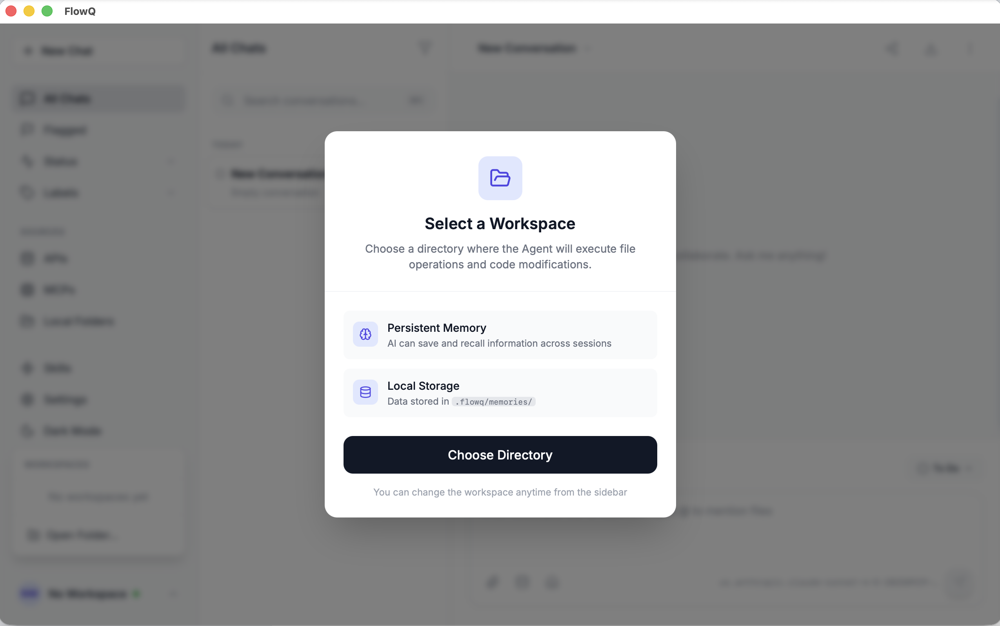
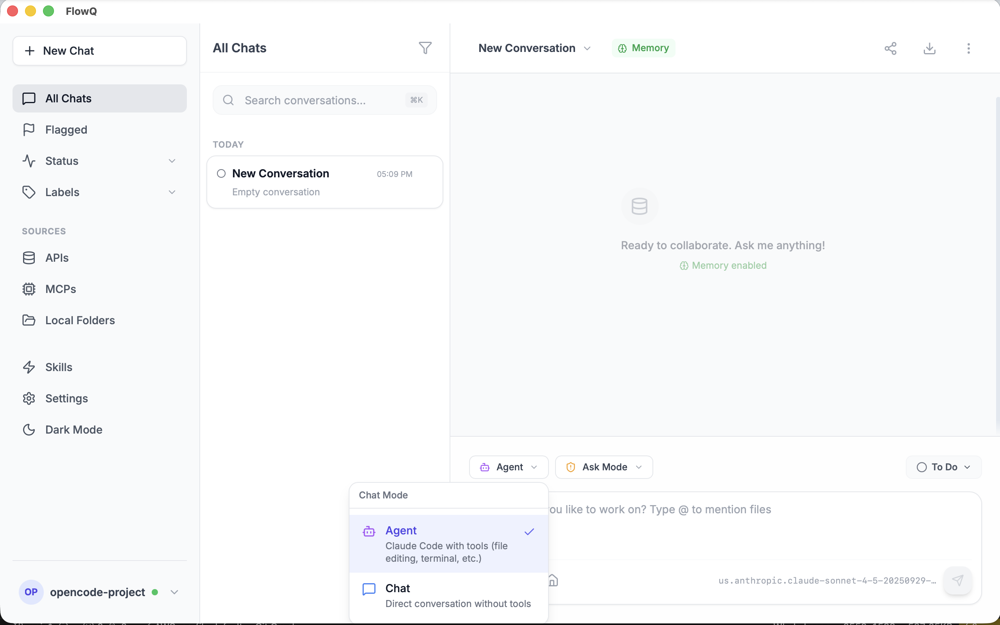
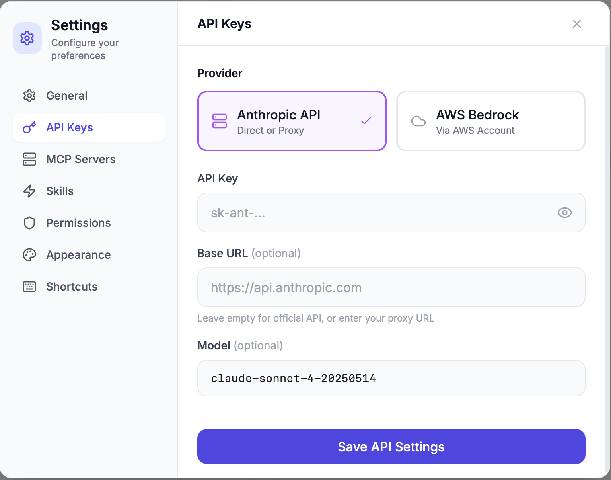
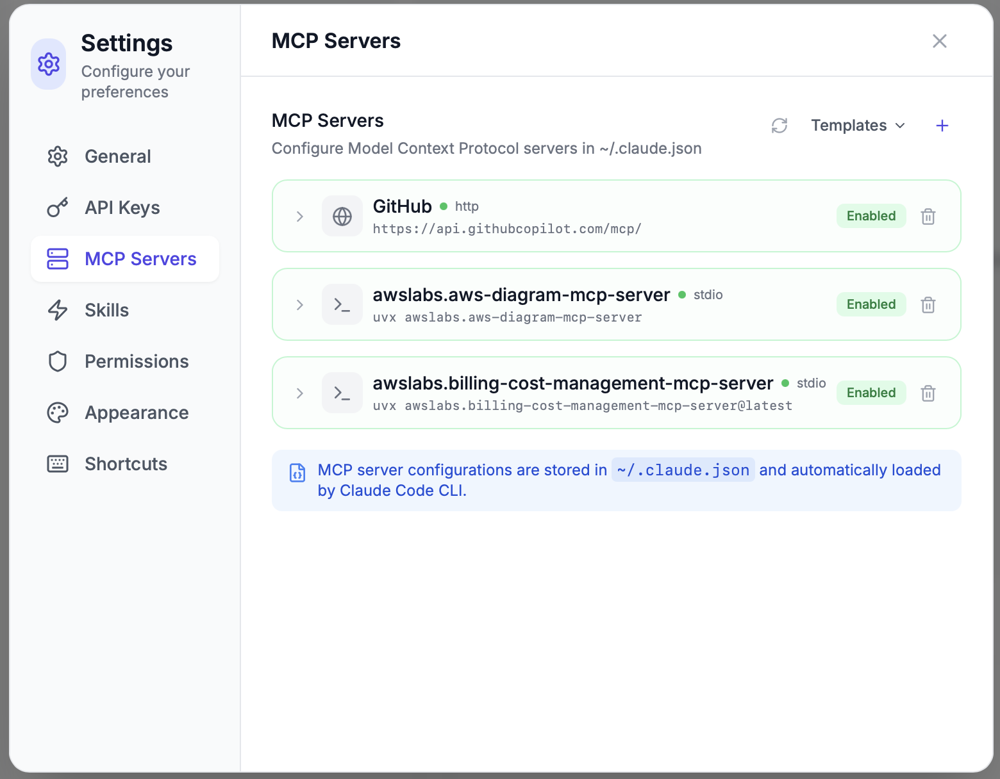
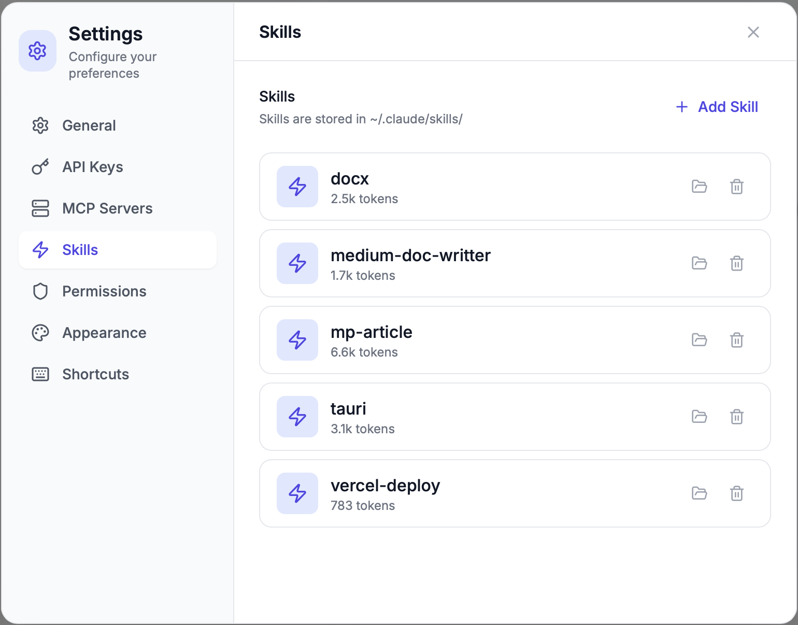

# FlowQ

<div align="center">


### Your local AI workspace, in flow.

*Stay focused. Stay local. Stay in flow.*

[](LICENSE)
[](https://tauri.app/)
[](https://react.dev/)

[English](README.md) | [中文](README.zh.md)

</div>

---

## Why FlowQ?

Stop context-switching. Stop juggling browser tabs. Stop losing your train of thought.

FlowQ brings AI to your desktop—**locally**, **privately**, **instantly**.

One window. One workspace. One flow.

---

## Features

### Core Capabilities

| Feature | Description |
|---------|-------------|
| **Chat & Agent Modes** | Toggle between direct conversation and tool-powered execution |
| **Multimodal Input** | Text + images in one message |
| **Multi-Provider** | Anthropic API · AWS Bedrock · OpenAI (coming soon) |
| **MCP Servers** | Extend with Model Context Protocol tools |
| **Skills** | Slash commands for common workflows (`/commit`, `/review`) |
| **Memory** | Persistent context across sessions per workspace |

### Data Sources & Integrations

| Category | Items |
|----------|-------|
| **Local Note Apps** | Obsidian · Craft · Logseq · Bear (100% private) |
| **Cloud Integrations** | Notion · GitHub · Google Drive · Slack · Linear |
| **Local Folders** | Direct workspace file access |

### Privacy First

- All data stored locally (SQLite + JSONL)
- API keys secured in system keychain
- No telemetry, no cloud sync
- Works offline (with local models)

---

## Screenshots

<div align="center">

### Workspace Selection


*Select a workspace to enable Memory and file operations*

### Chat & Agent Modes


*Seamless switching between Chat and Agent modes with sliding toggle*

### Settings

<table>
<tr>
<td align="center"><br><em>AI Provider</em></td>
<td align="center"><br><em>MCP Servers</em></td>
<td align="center"><br><em>Skills</em></td>
</tr>
</table>

</div>

---

## Quick Start

```bash
# Clone
git clone https://github.com/stevensu1977/flowq-app.git
cd flowq-app

# Install (pnpm required)
pnpm install

# Run development
pnpm tauri:dev

# Build for production
pnpm tauri:build
```

### Requirements

- Node.js 18+
- pnpm 8+
- Rust 1.70+
- [Tauri prerequisites](https://tauri.app/v1/guides/getting-started/prerequisites)

---

## Architecture

```
┌─────────────────────────────────────────────────────────────┐
│                     FlowQ Desktop App                        │
├─────────────────────────────────────────────────────────────┤
│  Frontend (React 19 + TypeScript + Vite)                    │
│  ├── Chat Window      - Message rendering, markdown         │
│  ├── Sidebar          - Sessions, filters, navigation       │
│  ├── Settings Panel   - Slide-over configuration            │
│  └── Components       - MCP, Skills, Integrations managers  │
├─────────────────────────────────────────────────────────────┤
│  Backend (Rust + Tauri 2.x)                                 │
│  ├── SQLite           - Session & message persistence       │
│  ├── Claude SDK       - AI model communication              │
│  └── Secure Storage   - API key management                  │
└─────────────────────────────────────────────────────────────┘
```

### Tech Stack

| Layer | Technologies |
|-------|-------------|
| **Frontend** | React 19 · TypeScript · Vite · Tailwind CSS |
| **Backend** | Rust · Tauri 2.x · SQLite (rusqlite) |
| **AI** | Claude Agent SDK · Anthropic API · AWS Bedrock |
| **Design** | "Ink & Paper" theme · Lora + Inter fonts |

---

## Configuration

### API Providers

FlowQ supports multiple AI providers:

**Anthropic API (Official)**
```
Settings > AI Provider > Anthropic API > Official
```

**Anthropic API (Custom Proxy)**
```
Settings > AI Provider > Anthropic API > Custom
Enter your proxy Base URL
```

**AWS Bedrock**
```
Settings > AI Provider > AWS Bedrock
Configure Region, Access Key, Secret Key
```

### MCP Servers

MCP server configurations are stored in `~/.claude.json`:

```json
{
  "mcpServers": {
    "filesystem": {
      "command": "npx",
      "args": ["-y", "@anthropic/mcp-server-filesystem", "/path/to/folder"]
    },
    "github": {
      "command": "npx",
      "args": ["-y", "@anthropic/mcp-server-github"]
    }
  }
}
```

### Skills

Custom skills are stored in `~/.claude/skills/`. Each skill is a markdown file with a prompt template:

```markdown
# My Custom Skill

Prompt template here with {{variables}}
```

---

## Roadmap

See [docs/ROADMAP.md](docs/ROADMAP.md) for the full product roadmap.

### Coming Soon

- [ ] Full-text search across sessions
- [ ] Session export (Markdown, JSON, PDF)
- [ ] Obsidian vault integration
- [ ] Keyboard shortcuts (`Cmd+K` command palette)
- [ ] Local model support (Ollama, LM Studio)

---

## Contributing

Contributions are welcome! Please read the project's coding standards in [CLAUDE.md](CLAUDE.md).

```bash
# Development
pnpm dev          # Frontend only
pnpm tauri:dev    # Full Tauri app

# Build
pnpm build        # Frontend only
pnpm tauri:build  # Full Tauri app
```

---

## License

MIT

---

<div align="center">

**FlowQ** — *Your local AI workspace, in flow.*

Made with ❤️ for developers who value focus and privacy.

</div>
